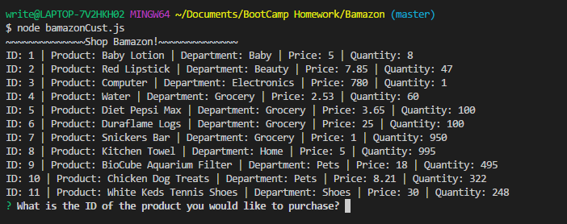
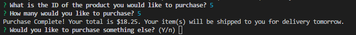
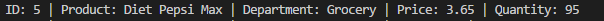
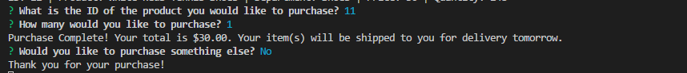

# Bamazon

Bamazon is a Amazon-like storefront utilizing MySQL. The app will take in orders from customers and deplete stock from the store's inventory. 

Product Table is populated when 'Node bamazonCust.js' is entered into node.
Customer is asked to enter the product number they want to purchase.

Customer is then asked what quantity of the item they would like to purchase.
Purchase is totaled and customer is asked if they would like to make another purchase.

Stock is depleted and when next purchase is queued for selection, you can see that it has dropped from 100 to 95.

If customer selects 'No' to another purchase they are Thanked for their purchase.

